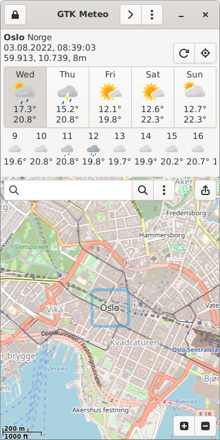

# GTK Meteo
Weather forecast application based on [java-gtk](https://github.com/bailuk/java-gtk) and [mapsforge-gtk](https://github.com/bailuk/mapsforge).
Forecast data is from [Meteorologisk institutt Norge](https://www.met.no).

## Features
- Select place from map or text search
- 6 Days forecast
- Optimized for small screens: tested on [PinePhone](https://www.pine64.org/pinephone/) 

## Screenshot
 

## Build
- Clone, compile and install [mapsforge-gtk](https://github.com/bailuk/mapsforge): `./gradlew mapsforge-map-gtk:install`
- Clone, compile and run this app: `./gradlew run` 
 
 ## License
© Map and data [OpenStreetMap contributors, ODbL 1.0](https://osm.org/copyright)  
© Icons and data [MET Norway](https://api.met.no/doc/License)  
Source code is licensed under the [MIT License](https://en.wikipedia.org/wiki/MIT_License)
